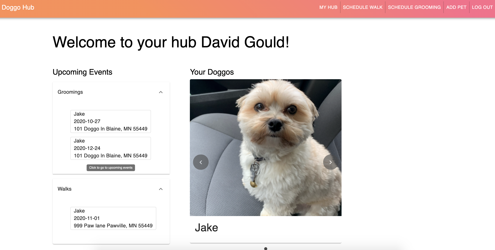

# Doggo Hub

## Description
_Duration: Two Week Sprint_

This app is designed to be an all in one place for your doggos!
You can find a deployed version of the application [here] (https://hidden-garden-55391.herokuapp.com/#/user)

## Screencap

## Technologies Used

-Axios
-React
-Redux
-PG
-PostgreSQL
-Node
-Material ui
-...

## Installation

1. In terminal run `npm install` to install necessary dependancies.
2. Create a database called `doggo_hub` and then run SQL commands provided in database.sql
3. Open terminal in text editor, run command `npm run server`
4. Open another terminal, run command `npm run client` , this should automatically open a browser for you displaying the app. (If this does not happen visit http://localhost:3000/#/)

## How to use
1. Log in or Register, after will be brought to user's main hub.

2. Nav bar will allow you to Add a pet, schedule a grooming, schedule a walk, go to your hub, or log out.

3. Upon clicking on either `Add a pet`, `schedule a grooming`, `schedule a walk` user will be brought to a form with validation.

4. Clicking on specific events in the upcoming events accordians will bring user to upcoming events where user is able to edit or delete that event.

5. Clicking on `Your Doggos` will bring user to doggos page where user will be able to edit or delete their doggos.